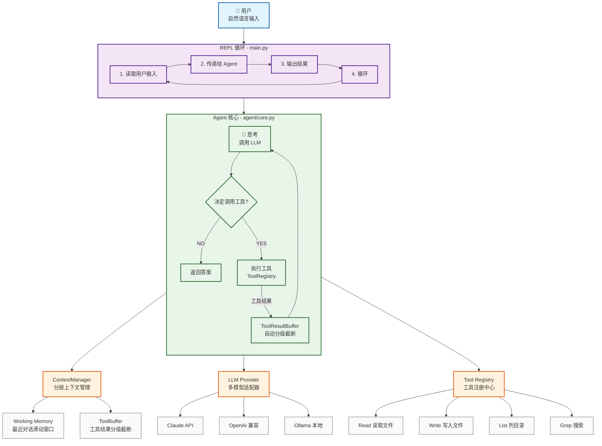

# 🧠 Code Agent - 基于 LLM 的智能编程助手

一个可扩展、支持多模型的命令行 AI 编程助手，类似 Claude Code 的开源实现。

---

## 📋 项目概述

Code Agent 是一个**思考-行动循环**架构的 AI 编程助手。你可以用自然语言描述需求，它会自动调用工具来完成任务：

- 📖 **读取文件** - 理解现有代码
- ✏️ **写入文件** - 创建或修改代码
- 🔍 **搜索文件** - grep 查找关键字
- 📂 **列出目录** - 浏览项目结构
- 🚀 **执行命令** - 运行脚本、编译、测试

### ✨ 核心特性

| 特性 | 状态 | 说明 |
|------|------|------|
| **可插拔 LLM** | ✅ | 支持 Claude、OpenAI、Ollama（本地模型） |
| **分层上下文管理** | ✅ | Token 预算可控，大文件自动截断 |
| **彩色终端体验** | ✅ | 6 种主题可选，支持实时预览 |
| **工具调用动画** | ✅ | 旋转加载动画，显示执行耗时 |
| **配置持久化** | ✅ | 主题、偏好自动保存 |

---

## 🏗️ 整体架构

> 💡 下图使用 Mermaid 绘制，GitHub、VS Code 等均支持直接渲染。



### 📦 主要模块说明

| 模块 | 目录 | 职责 |
|------|------|------|
| **Agent 核心** | `src/agent/` | 思考-行动循环，协调 LLM 和工具 |
| **上下文管理** | `src/context/` | 分层 Token 管理，工具结果分级截断 |
| **LLM Provider** | `src/llm/` | 统一的多模型适配器接口 |
| **工具系统** | `src/tools/` | 可插拔工具注册与执行 |
| **终端输出** | `src/utils/console.py` | 彩色输出、主题、动画 |
| **提示词** | `src/prompts/` | System Prompt 等提示词模板 |

---

## 🚀 快速开始

### 1. 安装依赖

```bash
# 使用 uv
uv sync
```

### 2. 配置 API Key

```bash
# 复制配置模板
cp .env.example .env
```

编辑 `.env` 文件，填入你的 API Key：

```env
# 选择 LLM 提供商
LLM_PROVIDER=claude  # 或 openai / ollama

# Claude 配置（推荐，工具调用最稳定）
ANTHROPIC_API_KEY=sk-ant-xxxxxxxxxxxxxx
ANTHROPIC_MODEL=claude-3-5-sonnet-20241022

# OpenAI 兼容配置（支持 DeepSeek、通义千问等）
# OPENAI_API_KEY=sk-...
# OPENAI_MODEL=gpt-4o
# OPENAI_BASE_URL=https://api.openai.com/v1

# Ollama 本地模型（无需 API Key）
# OLLAMA_MODEL=qwen2.5:7b
```

### 3. 运行程序

```bash
uv run python src/main.py
```

**首次启动会提示选择颜色主题，实时预览效果后确认即可。**

### 4. 使用示例

```
👤 你好，帮我看看这个项目的结构
🤖 Agent: 好的，让我先查看一下项目目录...

🔧 调用工具: ListDir
   path: .
   ✅ 工具执行完成

🤖 Agent: 这是一个 Code Agent 项目，主要结构如下：
- src/ 源代码目录
  - agent/ Agent 核心逻辑
  - context/ 上下文管理
  - llm/ LLM 提供商适配器
  - tools/ 工具实现
- test/ 测试脚本
- .config/ 用户配置
```

---

## 💻 特殊命令

在对话中可以输入以下命令：

| 命令 | 作用 |
|------|------|
| `/stats` | 显示上下文 Token 使用统计 |
| `/clear` | 清空当前上下文（开始新对话） |
| `/help` | 显示帮助信息 |
| `exit` / `quit` / `退出` | 退出程序 |

---

## ⚙️ 主要配置说明

所有配置项都在 `.env` 文件中：

### 🤖 LLM 相关配置

| 配置项 | 默认值 | 说明 |
|--------|--------|------|
| `LLM_PROVIDER` | `claude` | LLM 提供商：`claude` / `openai` / `ollama` |
| `MAX_ITERATIONS` | `20` | 单轮最大工具调用次数（防止无限循环） |

#### Claude 配置

| 配置项 | 默认值 | 说明 |
|--------|--------|------|
| `ANTHROPIC_API_KEY` | 必填 | Anthropic API Key |
| `ANTHROPIC_MODEL` | `claude-3-5-sonnet-20241022` | 模型名称 |

#### OpenAI 兼容配置

| 配置项 | 默认值 | 说明 |
|--------|--------|------|
| `OPENAI_API_KEY` | 必填 | API Key |
| `OPENAI_MODEL` | `gpt-4o` | 模型名称 |
| `OPENAI_BASE_URL` | `https://api.openai.com/v1` | API 地址（可改为兼容服务） |

#### Ollama 本地模型配置

| 配置项 | 默认值 | 说明 |
|--------|--------|------|
| `OLLAMA_MODEL` | 必填 | 模型名称（如 `qwen2.5:7b`） |
| `OLLAMA_HOST` | `http://localhost:11434` | Ollama 服务地址 |

---

### 🧠 上下文管理配置

| 配置项 | 默认值 | 说明 |
|--------|--------|------|
| `CONTEXT_TOTAL_BUDGET` | `150000` | 总 Token 预算上限 |
| `CONTEXT_WORKING_WINDOW_SIZE` | `10` | 工作记忆窗口（保留最近 N 轮对话） |
| `CONTEXT_WORKING_MAX_TOKENS` | `50000` | 工作记忆最大 Token 数 |
| `CONTEXT_TOOL_BUFFER_MAX_TOKENS` | `80000` | 工具结果缓冲最大 Token 数 |
| `CONTEXT_TOOL_SMALL_THRESHOLD` | `1000` | 小结果阈值（字符数，以下完整保留） |
| `CONTEXT_TOOL_LARGE_THRESHOLD` | `5000` | 大结果阈值（字符数，以上深度截断） |

**预算分配建议：**

| 模型类型 | `TOTAL_BUDGET` | `TOOL_BUFFER_MAX_TOKENS` |
|---------|----------------|---------------------------|
| Claude 3.5 Sonnet | `200000` | `120000` |
| GPT-4o | `128000` | `80000` |
| 本地 7B 模型 | `32000` | `12000` |

---

## 🧪 运行测试

```bash
# 运行上下文管理 Phase 1 测试
uv run python test/test_context_phase1.py
```

---

## 📁 项目结构

```
Code_Agent_CLI/
├── src/
│   ├── agent/
│   │   └── core.py              # Agent 思考-行动循环核心
│   ├── context/                  # 分层上下文管理
│   │   ├── __init__.py
│   │   ├── base.py             # Layer 抽象基类
│   │   ├── manager.py          # ContextManager 统一门面
│   │   ├── tool_buffer.py      # 工具结果缓冲层（分级截断）
│   │   ├── token_counter.py    # Token 估算工具
│   │   └── working.py          # 工作记忆层（滑动窗口）
│   ├── llm/                      # LLM 提供商适配器
│   │   ├── __init__.py
│   │   ├── base.py             # LLMProvider 抽象基类
│   │   ├── claude_provider.py  # Claude API 适配
│   │   ├── factory.py          # Provider 工厂函数
│   │   ├── ollama_provider.py  # Ollama 本地模型适配
│   │   └── openai_provider.py  # OpenAI 兼容 API 适配
│   ├── prompts/                  # 提示词模板
│   │   └── system.md           # 系统提示词
│   ├── tools/                    # 工具实现
│   │   ├── base.py             # BaseTool 基类
│   │   ├── grep.py             # 文本搜索工具
│   │   ├── list_dir.py         # 目录列出工具
│   │   ├── loader.py           # 工具注册与加载
│   │   ├── read.py             # 文件读取工具
│   │   └── write.py            # 文件写入工具
│   ├── utils/                    # 工具函数
│   │   └── console.py          # 彩色终端输出、主题、动画
│   └── main.py                  # 程序入口、REPL 循环
├── test/
│   ├── README.md                # 测试说明
│   └── test_context_phase1.py  # 上下文管理 Phase 1 测试
├── .config/                     # 用户配置（自动生成）
│   └── theme.json             # 主题设置
├── .env                         # 环境配置（自行创建）
├── .env.example                # 配置模板
├── pyproject.toml              # 项目配置、依赖
└── README.md                   # 本文件
```

---

## 🎯 路线图

| 阶段 | 内容 | 状态 |
|------|------|------|
| Phase 0 | REPL 骨架 + 基础工具 | ✅ |
| Phase 1 | 多 LLM Provider 架构 | ✅ |
| Phase 2 | 彩色终端 + 主题系统 | ✅ |
| **Phase 3** | **分层上下文管理（当前）** | 🚧 |
| Phase 4 | 工具结果精确对齐 | ⏳ |
| Phase 5 | 历史对话摘要层 | ⏳ |
| Phase 6 | 长期记忆持久化 | ⏳ |

---

## 📝 开发命令

```bash
# 代码检查
uv run ruff check src/

# 自动修复
uv run ruff check src/ --fix

# 运行测试
uv run python test/test_context_phase1.py
```

---

## 🤝 许可证

MIT License
