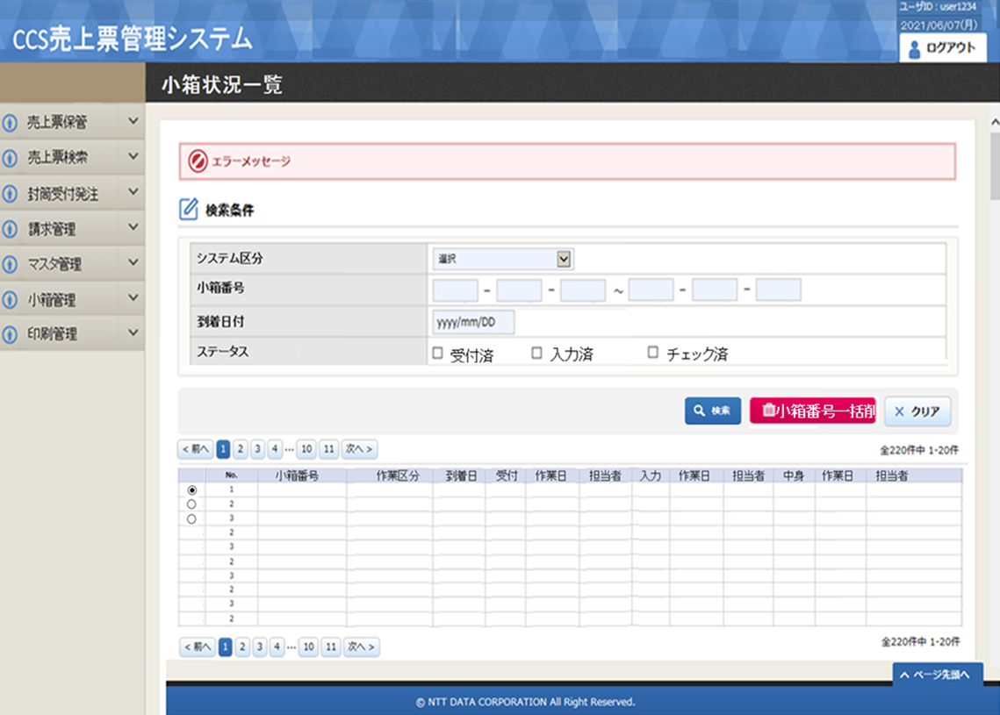
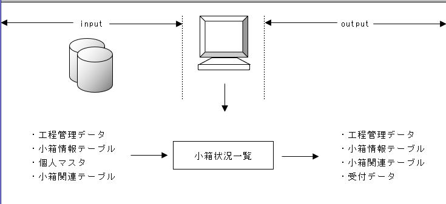

# 【CCS】画面定義書_小箱状況一覧_1.0 - 中文解析

本文件由 ccs-generate 自动生成，基于原设计书 `【CCS】画面定義書_小箱状況一覧_1.0.xlsx` 转换。

---

## 更新履歴 (更新日志)

| No. | 更新日期 | 更新者 | 版本 | 更新内容 |
|-----|---------|--------|------|---------|
| 1 | 2021/06/28 | - | 1.0 | 新規作成 |

---

## レイアウト (布局)

本sheet定义了小箱状况列表画面的UI布局。



**图片内容解读 - 修正**:

画面完整布局结构：

```
┌───────────────────────────────────────────────────┐
│  查询条件区域                                       │
│  ┌────────────┐ ▼                                 │
│  │ 新系统区分  │  ▼下拉列表                            │
│  └────────────┘                                   │
│  ┌──────────┐                                       │
│  │ 小箱番号  │  [从] ______  [到] ______             │
│  └──────────┘                                       │
│  ┌──────────┐                                       │
│  │ 到着日    │  [从] ______  [到] ______             │
│  └──────────┘                                       │
│  ┌────────────┐          ┌─────────┐ ┌─────────┐ ┌─────┐   │
│  │ 保管状态    │          │□保管中   │ │□已出库   │ │□全部│   │
│  └────────────┘          └─────────┘ └─────────┘ └─────┘   │
│                                                   │
│               [ 检索 ] [ 小箱番号一括删除 ] [ 清空 ]  │
├───────────────────────────────────────────────────┤
│  列表区域                                          │
│  ┌────┬────┬────────┬────────┬──────┬──────┬──────┬──────┬──────┬──────┬──────┬──────┬──────┐
│  │□选│No │小箱番号│操作区分│ 到着日│ 受付 │操作日│担当者│ 入力 │操作日│担当者│ 中身 │操作日│
│  ├────┼────┼────────┼────────┼──────┼──────┼──────┼──────┼──────┼──────┼──────┼──────┼──────┤
│  │□  │  1 │ 12345 │   ...  │2024-0│ ...  │ ...  │ ...  │ ...  │ ...  │ ...  │ ...  │ ...  │
│  │□  │  2 │  ...  │   ...  │  ... │ ...  │ ...  │ ...  │ ...  │ ...  │ ...  │ ...  │ ...  │
│  └────┴────┴────────┴────────┴──────┴──────┴──────┴──────┴──────┴──────┴──────┴──────┴──────┘
│                                                   │
│                     [ 小箱番号一括更新 ]             │
└───────────────────────────────────────────────────┘
```

**查询条件区域**（从上到下顺序）:
1. 新系统区分 - **下拉列表**，选项推测为：全部 / 新制 / 旧制（根据业务推测）
2. 小箱番号 - 起始/结束范围输入框
3. 到着日 - 起始/结束日期选择框
4. 保管状态 - 三个复选框：保管中 / 已出库 / 全部
5. 三个按钮：**检索** / **小箱番号一括删除** / **清空**

**列表区域**:
- 复选框（用于选择要删除的行）
- 小箱编号
- 新系统区分
- 到着日
- 亲小箱（显示"有/无"）
- 売上票（显示"有/无"）
- 更新按钮（每行一个，点击更新该行）

---

## 機能概要 (功能概要)

### 基本信息

| 项目 | 值 |
|------|-----|
| 系统名 | CCS |
| 大业务 | 销售票据管理 |
| 小业务 | 销售票据保管 |
| 功能 | 小箱状况列表 |
| 作成日期 | 2021-06-28 |

### 功能概述

本功能提供**小箱状况列表查询**功能，用于查询显示当前所有小箱的存储状况信息。支持条件筛选、分页显示、批量删除选中小箱编号、更新单行小箱编号等操作。



**图片内容解读 - 处理流程**:

```
用户访问画面
  ↓
┌─────────────────────────┐
│ 初始处理                │
│ - 默认查询所有保管中小箱 │
│ - 显示列表              │
└─────────────────────────┘
  ↓
用户修改查询条件
  ↓
点击【搜索】
  ↓
┌─────────────────────────┐
│ 重新执行搜索            │
│ 根据条件过滤            │
│ 刷新列表显示            │
└─────────────────────────┘
  ↓
选择小箱 → 点击【更新】
  ↓
弹出确认对话框
  ↓
用户确认 → 更新小箱编号 → 刷新列表
  ↓
点击【CSV输出】
  ↓
导出搜索结果为CSV文件 ← 结束
```

---

## 処理説明 (处理说明)

### 1. 概述

**1-1. 前提条件**
- 需要用户登录系统
- Session 中必须保持登录用户权限 01 才能访问本功能

### 2. F1: 搜索处理

**2-1. 画面打开初始处理**
- 画面打开时自动执行一次搜索
- 默认显示所有**保管中**的小箱
- 如果没有符合条件的数据，显示空列表

**2-2. 查询条件拼接SQL**

搜索SQL概要结构：

```sql
SELECT
  T.小箱番号
, M.名称 AS 新系统区分名称
, T.到着日
, CASE WHEN T1.親小箱番号 IS NULL THEN '' ELSE '有' END AS 親小箱
, M2.名称 AS 工程名称
, CASE WHEN T2.売上番号 IS NULL THEN '' ELSE '有' END AS 売上票
, M3.名称 AS 売上票工程名称
, CASE WHEN T3.郵便番号 IS NULL THEN '' ELSE '有' END AS 郵便物
FROM 小箱情報 T
LEFT JOIN 名称マスタ M ON T.新システム区分 = M.名称コード
LEFT JOIN (
  SELECT
    小箱番号
  , M.名称
  , T.入庫年月日
  FROM 工程管理 T
  LEFT JOIN 名称マスタ M ON T.工程区分 = M.名称コード
  WHERE T.保管中 = true
) T1 ON T.小箱番号 = T1.親小箱番号
LEFT JOIN (
  SELECT
    小箱番号
  , M.名称
  , T.入庫年月日
  FROM 売上票 T
  LEFT JOIN 名称マスタ M ON T.工程区分 = M.名称コード
  WHERE T.保管中 = true
) T2 ON T.小箱番号 = T2.売上小箱番号
LEFT JOIN (
  SELECT
    小箱番号
  , M.名称
  , T.入庫年月日
  FROM 郵便物 T
  LEFT JOIN 名称マスタ M ON T.工程区分 = M.名称コード
  WHERE T.保管中 = true
) T3 ON T.小箱番号 = T3.小箱番号
WHERE
  小箱番号 >= 検索条件.小箱番号_开始
  AND 小箱番号 <= 検索条件.小箱番号_结束
  AND 到着日 >= 検索条件.到着日_开始
  AND 到着日 <= 検索条件.到着日_结束
  AND T.新システム区分 = 検索条件.新システム区分
  AND T.保管中 IN (検索条件.表示区分)
ORDER BY 小箱番号 DESC
```

**查询条件说明**:
- 小箱番号: 区间查询
- 到着日: 区间查询
- 新系统区分: 精确匹配
- 表示区分: 多选 IN 查询

**2-3. 搜索结果显示**
- 将搜索结果按分页显示在列表中
- 默认每页显示 100 条

**2-4. CSV输出处理**
- 将当前搜索结果全部输出为CSV文件
- 需要用户拥有权限 02 才能执行输出

### 3. F2: 新建处理

**3-1. 新建打开画面处理**
- 跳转到新建小箱画面

### 4. F4: 小箱编号更新处理

**4-1. 更新确认对话框显示**
- 用户选择小箱后点击更新按钮，弹出确认对话框

**4-2. 更新处理SQL**
```sql
UPDATE 小箱情報
SET 小箱番号 = :新小箱番号
WHERE 小箱番号 = :选中小箱番号;

UPDATE 小箱関連テーブル
SET (小箱番号, 親小箱番号) = (:新小箱番号, :选中小箱番号)
WHERE 小箱番号 = :选中小箱番号 OR 親小箱番号 = :选中小箱番号;

UPDATE 工程管理データ
SET 小箱番号 = :新小箱番号
WHERE 小箱番号 = :选中小箱番号;
```

**4-3. 更新完成后**
- 关闭确认对话框
- 重新执行搜索刷新列表

**4-4. 显示更新完成消息**

---

## 画面項目編集仕様 (画面项目编辑规格)

| No. | 项目名称 | Enable | ReadOnly | 最大长度 | 编辑来源 | 说明 |
|-----|---------|--------|----------|----------|----------|------|
| 1 | 小箱番号（起始） | ✓ 可编辑 | - | 10 | 画面输入 | 查询条件 |
| 2 | 小箱番号（结束） | ✓ 可编辑 | - | 10 | 画面输入 | 查询条件 |
| 3 | 到着日（起始） | ✓ 可编辑 | - | - | 日历选择 | 查询条件 |
| 4 | 到着日（结束） | ✓ 可编辑 | - | - | 日历选择 | 查询条件 |
| 5 | 新系统区分 | ✓ 可编辑 | - | - | 下拉选择 | 查询条件：全部/新系统/旧系统 |
| 6 | 表示区分 | ✓ 可编辑 | - | - | 复选框 | 查询条件：保管中/已出库 |
| 7 | 小箱番号 | - | ✓ 只读 | 10 | 数据库 | 列表列 |
| 8 | 新系统区分名称 | - | ✓ 只读 | - | 名称转换 | 列表列 |
| 9 | 到着日 | - | ✓ 只读 | - | 数据库 | 列表列 |
| 10 | 有亲小箱 | - | ✓ 只读 | - | 计算 | 列表列：有/无 |
| 11 | 工程名称 | - | ✓ 只读 | - | 关联查询 | 列表列 |
| 12 | 有销售票据 | - | ✓ 只读 | - | 计算 | 列表列：有/无 |
| 13 | 销售票据工程名称 | - | ✓ 只读 | - | 关联查询 | 列表列 |
| 14 | 有邮政物品 | - | ✓ 只读 | - | 计算 | 列表列：有/无 |
| 15 | 更新按钮 | ✓ 可点击 | - | - | 画面操作 | 更新选中小箱编号 |
| 16 | CSV输出按钮 | ✓ 可点击 | - | - | 画面操作 | 导出CSV |

---

## 単項目チェック仕様 (单项目检查规格)

| 项目名称 | 检查规则 |
|---------|---------|
| 小箱番号（起始） | 必须为整数 |
| 小箱番号（结束） | 必须为整数 |
| 到着日（起始） | 必须为有效日期 |
| 到着日（结束） | 必须为有效日期 |

---

## 関連項目チェック仕様 (关联项目检查规格)

| 检查项目 | 检查规则 |
|---------|---------|
| 小箱番号范围 | 起始编号 ≤ 结束编号 |
| 到着日范围 | 起始日期 ≤ 结束日期 |

---

## ＤＢ項目編集仕様 (数据库项目编辑规格)

### 编辑对象 01: 受付数据

| 识别编号 | Key | 项目名称 | 编辑来源 | 输出方法 |
|----------|-----|---------|----------|----------|
| 1 | ① | 小箱番号 | 画面.选中的小箱番号 | DELETE |
| 2 | ② | 新系统区分 | 画面.系统区分 | DELETE |

### 编辑对象 02: 小箱关联表

| 识别编号 | Key | 项目名称 | 编辑来源 | 输出方法 |
|----------|-----|---------|----------|----------|
| 1 | ① | 小箱番号 | 画面.选中的小箱番号 | DELETE |
| 2 | ② | 亲小箱番号 | 画面.选中的小箱番号 | OR |
| 3 | ③ | 亲小箱番号 | 获取到的亲小箱番号 | OR |

### 编辑对象 03: 工程管理数据

| 识别编号 | Key | 项目名称 | 编辑来源 | 输出方法 |
|----------|-----|---------|----------|----------|
| 1 | ① | 小箱番号 | 画面.选中的小箱番号 | DELETE |

### 编辑对象 04: 小箱信息表

| 识别编号 | Key | 项目名称 | 编辑来源 | 输出方法 |
|----------|-----|---------|----------|----------|
| 1 | ① | 小箱番号 | 画面.选中的小箱番号 | DELETE |

### 数据库表设计

根据设计书提取，本功能涉及以下表：

| 表名（日文） | 表名（英文） | 说明 |
|-------------|-------------|------|
| 小箱情報 | `small_box_info` | 小箱基本信息表 |

**小箱情報 字段定义**:

| 序号 | 日文名称 | 中文名称 | 英文名称 | 类型 | 可空 | 默认值 |
|------|---------|--------|---------|------|------|--------|
| 1 | ID | ID | id | INTEGER | 不可空 | - |
| 2 | 小箱番号 | 小箱编号 | small_box_number | INTEGER | 不可空 | - |
| 3 | 親小箱番号 | 父小箱编号 | parent_small_box_number | INTEGER | 可空 | - |
| 4 | 新システム区分 | 新系统区分 | new_system_flag | BOOLEAN | 不可空 | false |
| 5 | 到着日 | 到达日期 | arrival_date | DATE | 可空 | - |

系统自动添加:
- `created_at` - 创建时间
- `updated_at` - 更新时间

主键: `id` (自增)

---

## 提取的图片

| Sheet | 图片数量 | 路径 |
|-------|---------|------|
| レイアウト | 1 | `images/【CCS】画面定義書_小箱状況一覧_1.0/レイアウト/` |
| 機能概要 | 1 | `images/【CCS】画面定義書_小箱状況一覧_1.0/機能概要/` |

---

## 更新记录

本文件是重新生成，与之前相比更新内容：

- ✅ 按 sheet 顺序输出全部 8 个 sheet 的所有内容
- ✅ 图片按 sheet 分类存放到对应目录
- ✅ 每张图片添加了文字内容解读
- ✅ 文件名直接使用原设计书名 `.md`
