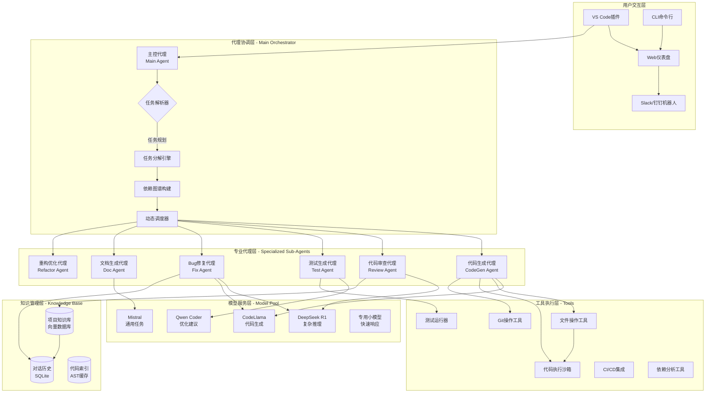

```mermaid
graph TB
    subgraph 用户交互层[用户交互层]
        UI1[VS Code插件] --> UI2[Web仪表盘] --> UI3[Slack/钉钉机器人]
        UI4[CLI命令行] --> UI2
    end

    subgraph 代理协调层[代理协调层 - Main Orchestrator]
        direction TB
        C1[主控代理<br/>Main Agent] --> C2{任务解析器}
        C2 -->|任务规划| C3[任务分解引擎]
        C3 --> C4[依赖图谱构建]
        C4 --> C5[动态调度器]
    end

    subgraph 专业代理层[专业代理层 - Specialized Sub-Agents]
        direction LR
        S1[代码生成代理<br/>CodeGen Agent]
        S2[代码审查代理<br/>Review Agent]
        S3[测试生成代理<br/>Test Agent]
        S4[Bug修复代理<br/>Fix Agent]
        S5[文档生成代理<br/>Doc Agent]
        S6[重构优化代理<br/>Refactor Agent]
    end

    subgraph 知识管理层[知识管理层 - Knowledge Base]
        K1[(项目知识库<br/>向量数据库)]
        K2[(对话历史<br/>SQLite)]
        K3[(代码索引<br/>AST缓存)]
    end

    subgraph 工具执行层[工具执行层 - Tools]
        T1[文件操作工具]
        T2[代码执行沙箱]
        T3[Git操作工具]
        T4[CI/CD集成]
        T5[测试运行器]
        T6[依赖分析工具]
    end

    subgraph 模型服务层[模型服务层 - Model Pool]
        M1[DeepSeek R1<br/>复杂推理]
        M2[CodeLlama<br/>代码生成]
        M3[Qwen Coder<br/>优化建议]
        M4[Mistral<br/>通用任务]
        M5[专用小模型<br/>快速响应]
    end

    UI1 --> C1
    C5 --> S1 & S2 & S3 & S4 & S5 & S6
    S1 --> M2
    S2 --> M1
    S3 --> M3
    S4 --> M1 & M2
    S5 --> M4
    S1 --> T1 & T2 & T3
    S2 --> K1
    S3 --> T5
    S4 --> K2
    K1 --> K2
    T1 --> T2
```