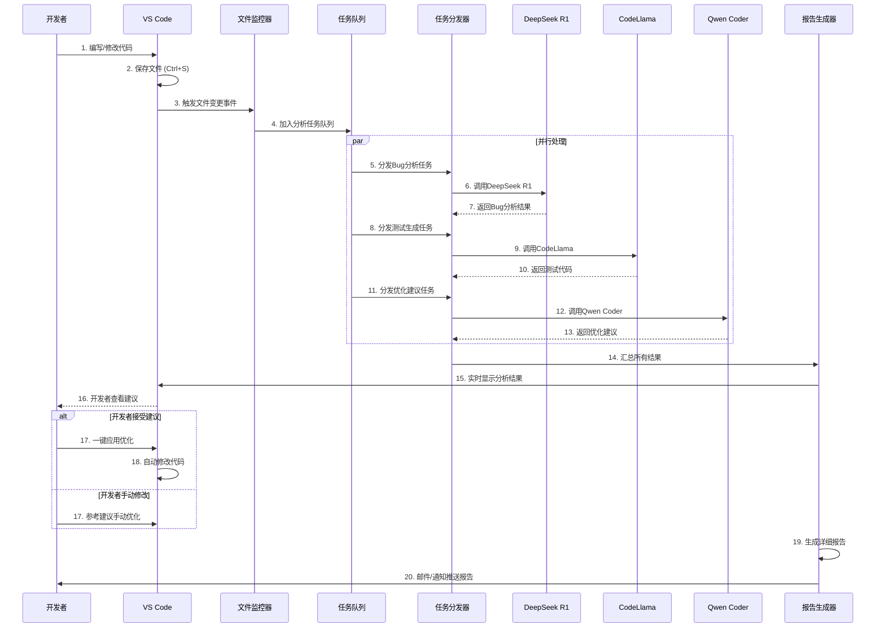

```mermaid
sequenceDiagram
    participant Dev as 开发者
    participant VSC as VS Code
    participant Watcher as 文件监控器
    participant Queue as 任务队列
    participant Dispatcher as 任务分发器
    participant DS as DeepSeek R1
    participant CL as CodeLlama
    participant QC as Qwen Coder
    participant Report as 报告生成器

    Dev->>VSC: 1. 编写/修改代码
    VSC->>VSC: 2. 保存文件 (Ctrl+S)
    VSC->>Watcher: 3. 触发文件变更事件
    Watcher->>Queue: 4. 加入分析任务队列
    
    par 并行处理
        Queue->>Dispatcher: 5. 分发Bug分析任务
        Dispatcher->>DS: 6. 调用DeepSeek R1
        DS-->>Dispatcher: 7. 返回Bug分析结果
        
        Queue->>Dispatcher: 8. 分发测试生成任务
        Dispatcher->>CL: 9. 调用CodeLlama
        CL-->>Dispatcher: 10. 返回测试代码
        
        Queue->>Dispatcher: 11. 分发优化建议任务
        Dispatcher->>QC: 12. 调用Qwen Coder
        QC-->>Dispatcher: 13. 返回优化建议
    end

    Dispatcher->>Report: 14. 汇总所有结果
    Report->>VSC: 15. 实时显示分析结果
    VSC-->>Dev: 16. 开发者查看建议
    
    alt 开发者接受建议
        Dev->>VSC: 17. 一键应用优化
        VSC->>VSC: 18. 自动修改代码
    else 开发者手动修改
        Dev->>VSC: 17. 参考建议手动优化
    end
    
    Report->>Report: 19. 生成详细报告
    Report->>Dev: 20. 邮件/通知推送报告
```