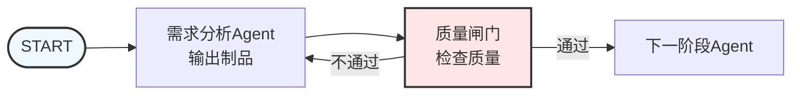
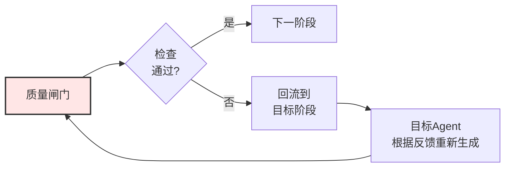
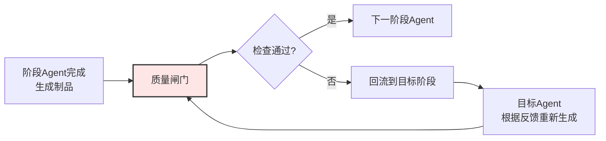
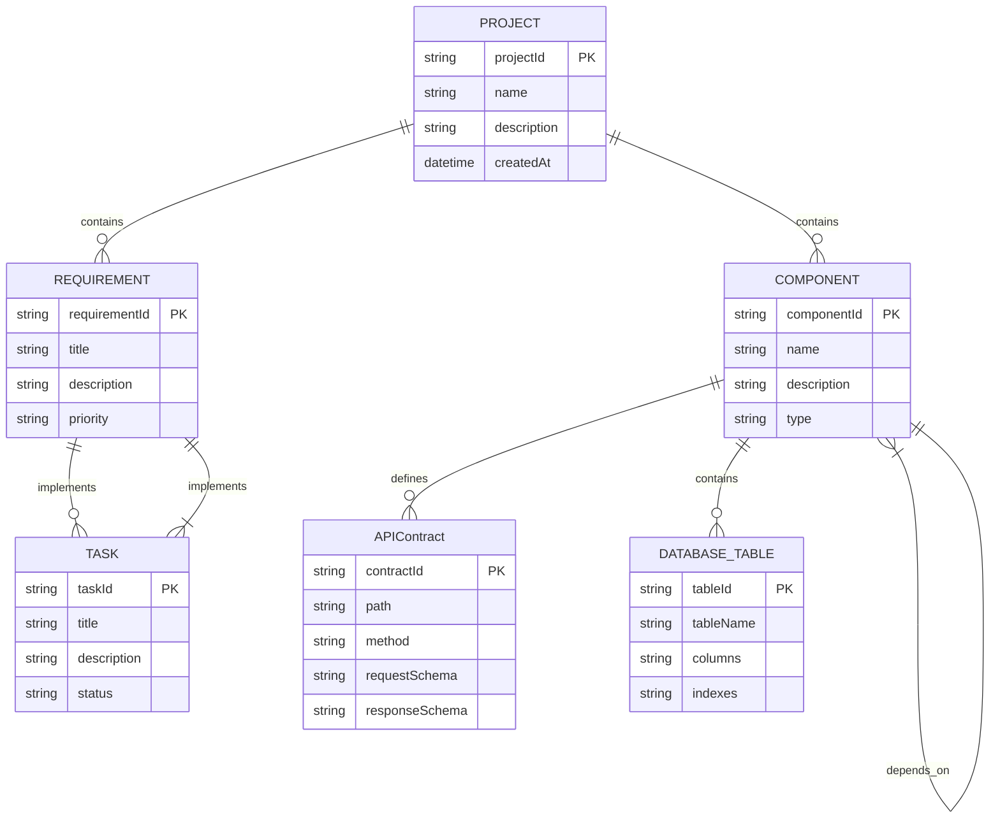
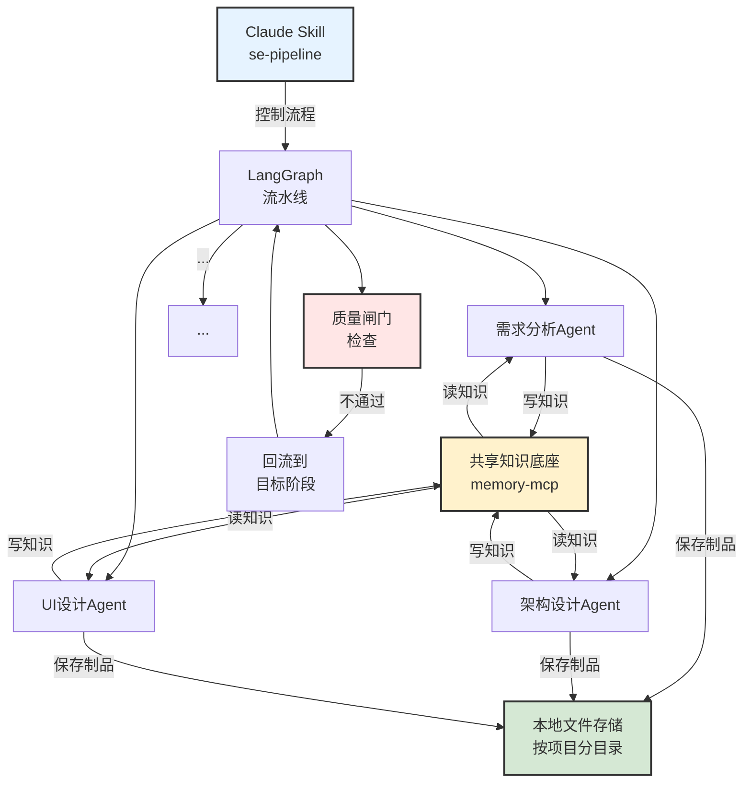
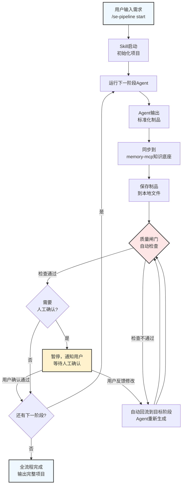

# 软件工程多Agent流水线系统 - 可行性实施计划

> 核心理念：按软件工程流程分工，每个阶段由专门Agent负责，输出标准化制品作为下一Agent输入，质量闸门把控质量，支持反馈回流修改，共享知识底座保证一致性。

---

## 📋 项目概述

### 核心思想

传统AI编程：一个大Agent从头到尾乱撞，改来改去，不可控，不可重现。

本方案：
- **分工专业化** - 每个Agent只做一件事，做到专业
- **阶段明确化** - 每个阶段输出标准化制品
- **质量可控化** - 每个阶段后质量闸门，不合格回流修改
- **可重现可追溯** - 所有制品保存，重新运行流水线就能重建项目
- **反馈闭环** - 支持从后面阶段回流到前面阶段修改，不是纯瀑布

### 优势对比

| 维度 | 传统单Agent方式 | 本流水线方式 |
|------|----------------|-------------|
| 确定性 | 低（随机补补丁） | 高（阶段化可控） |
| 可重建 | 差（依赖对话历史） | 好（全制品留存，重新跑就行） |
| 可追溯 | 差（问题难定位） | 好（哪个阶段错了改哪个） |
| 专业化 | 弱（一个Agent啥都干） | 强（每个Agent深耕一个领域） |
| 需求变更 | 难（容易改乱） | 易（只改影响阶段） |

---

## 🎯 系统架构设计

### 整体流程拓扑

#### 单阶段质量闸门循环



#### 完整流水线主干流程


**回流特性：** 任何一个质量闸门发现问题，都可以**直接回跳到任意前面的任意阶段**修改，不需要从头再来。



**关键特性**：任何一个质量闸门发现问题，可以回流到**任意前面阶段**修改，不需要从头再来。

---

## 🔄 各Agent职责与制品定义

### 标准化制品格式

每个Agent输出都采用统一格式：

````
# [阶段名称] - [项目名称]

## 概述
...文字描述...

## 结构化输出（JSON）
```json
{
  "version": "1.0",
  "stageId": "requirements",
  "projectId": "...",
  "timestamp": "2026-...",
  "data": {
    // 具体结构化数据
  }
}
```
````

优势：
- Markdown 让人读
- JSON 让下一Agent机器读
- 简单易解析，不需要复杂格式处理

---

### 10个Agent完整职责表

| 序号 | Agent | 职责 | 输入 | 输出制品 | 质量检查要点 |
|:--:|:-------|:-----|:-----|:---------|:-------------|
| 1a | **需求分析师** | 通过交互式询问逐步澄清用户模糊需求，挖掘真实需求 | 用户原始需求 + 历史问答 | `intermediate/qa-history.json`<br/>`intermediate/draft-requirements.md` | - |
| 1b | **需求验证官** | 独立重新阅读所有问答，验证需求是否足够清晰，若仍有疑问则要求继续提问 | 完整问答历史 + 草案需求 | 验证结论 + 是否需要继续提问 | 发现遗漏<br/>发现歧义 |
| 1 | **需求分析（输出）** | 所有问题澄清后，整理生成最终标准化需求规格 | 完整问答历史 + 验证通过 | `01-requirements-spec.md`<br/>`requirements.json`<br/>`qa-history.json` | 完整性<br/>清晰性<br/>可测试性<br/>无歧义 |
| 2 | **架构设计** | 设计整体架构、技术选型、模块划分、接口契约 | 需求规格 | `02-architecture-design.md`<br/>`architecture.json` | 模块化<br/>可扩展性<br/>技术选型适配<br/>依赖合理 |
| 3 | **UI/原型** | 设计页面结构、组件划分、交互流程 | 需求+架构 | `03-ui-prototype.md`<br/>`wireframes.json` | 覆盖所有需求<br/>用户体验一致<br/>交互清晰 |
| 4 | **数据库设计** | 设计表结构、关系、索引、约束 | 需求+架构+UI | `04-database-schema.md`<br/>`schema.sql`<br/>`er-diagram.json` | 范式遵守<br/>关系正确<br/>索引合理<br/>约束完整 |
| 5 | **任务拆分** | 拆分成可开发的用户故事/开发任务 | 前序所有制品 | `05-task-backlog.md`<br/>`tasks.json` | 颗粒度适中<br/>依赖清晰<br/>可估算<br/>无重叠 |
| 6 | **代码生成** | 按照任务和设计生成完整代码实现 | 任务+设计 | 代码文件树<br/>`implementation-notes.md` | 符合架构设计<br/>遵守编码规范<br/>功能完整 |
| 7 | **代码评审** | 评审代码质量、发现潜在问题 | 生成的代码 | `07-code-review-report.md`<br/>`issues.json` | 潜在bug<br/>可维护性<br/>安全问题<br/>符合设计 |
| 8 | **测试验证** | 生成测试用例、执行测试、输出结果 | 代码+任务 | `08-test-report.md`<br/>`test-cases.json` | 覆盖率<br/>通过率<br/>边界覆盖 |
| 9 | **预发布检查** | 整体一致性校验、完整性检查 | 所有前序制品 | `09-pre-release-check.md`<br/>`consistency-report.json` | 设计与实现一致<br/>所有需求都实现<br/>部署准备完成 |
| 10 | **部署运维** | 生成部署配置、监控文档、运维指南 | 所有前序制品 | `10-deployment-config.md`<br/>配置文件 | 可部署性<br/>监控完整<br/>文档清晰 |

---

## 🚪 质量闸门机制

每个阶段完成后，必须经过质量闸门才能进入下一阶段。

### 两种评审模式

#### 1️⃣ **自动评审（LLM驱动）**

流程：
1. 质量闸门加载该阶段预设的**质量检查清单**
2. LLM对照清单逐项检查当前制品
3. 输出检查结果和问题列表
4. 分级：error / warning / info

判定规则：
- ✅ **通过**：没有error级问题
- ❌ **不通过**：存在error级问题 → 自动回流到对应阶段

检查清单示例（需求分析阶段）：
```python
requirements_checklist = [
  CheckItem(id='complete', question='是否覆盖了用户所有需求？', severity='error'),
  CheckItem(id='clear', question='每个需求描述是否清晰无歧义？', severity='error'),
  CheckItem(id='testable', question='每个需求是否可测试验证？', severity='warning'),
  CheckItem(id='prioritized', question='需求是否区分了优先级？', severity='info'),
];
```

#### 2️⃣ **人工评审**

流程：
1. 自动评审通过后（或独立），展示制品给用户
2. 用户可以：
   - ✅ **通过** → 进入下一阶段
   - ❌ **拒绝修改** → 填写反馈 → 回流到指定阶段
   - 🔀 **直接跳转** → 直接跳转到指定阶段修改

### 路由逻辑（在编排图中）



代码逻辑（LangGraph条件边）：

```python
def after_quality_gate(state) -> str:
    if state.quality_gate_result.passed:
        return NEXT_STAGE_MAP[current_stage]
    else:
        return state.quality_gate_result.target_stage_id
```

---

## 🔙 反馈回流修改机制

利用有环图（Cyclic Graph）原生支持回流：

### 支持三种回流场景

1. **自动回流**：质量闸门自动检查发现问题 → 设置目标阶段 → 跳转回目标阶段 → 目标Agent结合反馈重新生成 → 重新走后续流程

2. **人工触发回流**：用户在任意时刻点击"修改此阶段" → 填写反馈 → 从该阶段重新执行 → 后续阶段可以增量更新

3. **需求变更回流**：用户新增需求 → 回流到需求分析阶段 → 更新需求 → 后续阶段重新走一遍

### 版本管理

- 知识底座保存每个阶段的**所有历史版本**
- 支持版本对比，查看修改了什么
- 支持回滚到任意历史版本

### 增量更新优化

- 修改后，已通过且未受影响的阶段可以**选择跳过**，不用重新运行
- 只重新生成受修改影响的阶段
- 大幅节省LLM成本和时间

---

## 📚 共享知识底座设计

### 决策：复用并扩展现有的 `memory-mcp` 知识图谱

架构：



### 知识图谱模型

| 实体类型 | 说明 |
|---------|------|
| `Project` | 整个项目 |
| `Requirement` | 一个用户需求 |
| `Component` | 一个架构组件/模块 |
| `APIContract` | API接口契约 |
| `DatabaseTable` | 数据库表 |
| `Task` | 开发任务 |

| 关系类型 | 说明 |
|---------|------|
| `contains` | Project 包含 Requirement/Component |
| `implements` | Task/Component 实现 Requirement |
| `depends_on` | Component 依赖 Component |
| `refines` | 新版本改进自旧版本 |

### 优势

- ✅ 复用现有的 `memory-mcp` 基础设施，不重复造轮子
- ✅ 知识图谱天生适合存储设计依赖和关联关系
- ✅ 任何Agent执行前都可以查询知识图谱，获取完整上下文，保证一致性
- ✅ 支持增量添加新知识

### 知识图谱存储位置

当前项目整体知识图谱存储在：
```
D:\dev\learn-ai\memory-mcp\dist\memory.jsonl
```

### 知识图谱更新机制

**每个Agent产出制品后，自动完成知识图谱更新**：

```
Agent生成制品 → LLM自动提取关键信息（实体+关系）→ 自动写入memory-mcp → 后续Agent执行前从知识图谱读取完整上下文
```

- ✅ **全自动** - 不需要人工操作，对用户透明
- ✅ **自动增量更新** - 修改重新生成后，自动更新知识图谱
- ✅ **支持手动编辑** - 如果发现提取错误，提供手动入口供用户修正

**为什么全自动？**
- 知识图谱的目的就是给后续Agent提供一致的上下文，自动化才能保证一致性
- 手动更新太繁琐，增加用户负担
- LLM从标准化制品中提取实体关系，准确率足够满足需求

---

## 🏗️ 技术选型决策

### 最终决策：**Python + uv + LangGraph**

用户明确要求使用 Python 开发，因此整个系统用 Python 实现。

```
software-engineering-agent-pipeline/
├── pyproject.toml                    # 项目依赖配置 (uv)
├── README.md                         # 项目说明
├── plan.md                           # 本计划文档
├── src/se_pipeline/
│   ├── __init__.py
│   ├── types/
│   │   ├── __init__.py              # 导出
│   │   ├── artifacts.py             # 制品类型定义 (Pydantic)
│   │   ├── pipeline.py              # 流水线状态类型
│   │   └── quality_gate.py          # 质量闸门类型
│   ├── agents/
│   │   ├── __init__.py
│   │   ├── base.py                  # Agent基类/抽象接口
│   │   ├── requirements_agent.py    # 需求分析Agent
│   │   ├── architecture_agent.py    # 架构设计Agent
│   │   ├── ui_prototype_agent.py    # UI原型设计Agent
│   │   ├── database_agent.py        # 数据库设计Agent
│   │   ├── task_breakdown_agent.py  # 任务拆分Agent
│   │   ├── codegen_agent.py         # 代码生成Agent
│   │   ├── codereview_agent.py      # 代码评审Agent
│   │   ├── testing_agent.py         # 测试验证Agent
│   │   ├── pre_release_agent.py     # 预发布检查Agent
│   │   └── deployment_agent.py      # 部署运维Agent
│   ├── prompts/
│   │   ├── requirements.md          # 需求分析提示词模板
│   │   ├── architecture.md          # 架构设计提示词模板
│   │   ├── ui_prototype.md          # UI原型提示词模板
│   │   ├── database.md              # 数据库设计提示词模板
│   │   ├── task_breakdown.md        # 任务拆分提示词模板
│   │   ├── codegen.md               # 代码生成提示词模板
│   │   ├── codereview.md            # 代码评审提示词模板
│   │   ├── testing.md               # 测试验证提示词模板
│   │   ├── pre_release.md           # 预发布检查提示词模板
│   │   ├── deployment.md            # 部署运维提示词模板
│   │   └── quality_checks/
│   │       ├── requirements.txt     # 需求阶段检查清单
│   │       ├── architecture.txt     # 架构阶段检查清单
│   │       ├── ui_prototype.txt     # UI设计检查清单
│   │       ├── database.txt         # 数据库检查清单
│   │       ├── task_breakdown.txt   # 任务拆分检查清单
│   │       ├── codegen.txt         # 代码生成检查清单
│   │       ├── codereview.txt       # 代码评审检查清单
│   │       ├── testing.txt          # 测试验证检查清单
│   │       ├── pre_release.txt      # 预发布检查清单
│   │       └── deployment.txt       # 部署检查清单
│   ├── graph/
│   │   ├── __init__.py
│   │   └── pipeline_graph.py        # LangGraph流水线定义
│   ├── knowledge/
│   │   ├── __init__.py
│   │   └── memory_mcp_client.py     # memory-mcp客户端封装
│   ├── quality_gate/
│   │   ├── __init__.py
│   │   ├── auto_reviewer.py         # 自动评审实现
│   │   └── checklists.py            # 检查清单定义
│   └── storage/
│       ├── __init__.py
│       └── project_store.py         # 项目和制品存储（本地文件）
├── examples/
│   └── todo_app/                    # 示例：待办应用完整输出
│       ├── 01-requirements-spec.md
│       ├── 02-architecture-design.md
│       ├── ...
│       └── code/
└── skills/
    └── se_pipeline_skill.py         # Claude Skill入口
```

**技术栈选择：**
- ✅ **Python** - 用户明确要求，生态成熟
- ✅ **uv** - 快速的Python包管理器
- ✅ **LangGraph** - 构建有环Agent流水线图，原生支持反馈回流
- ✅ **Pydantic** - 数据结构验证，确保制品格式正确
- ✅ **Anthropic SDK** - Claude API调用
- ✅ **MCP Python SDK** - 连接memory-mcp知识图谱服务

### 核心架构



**说明：**
- **LangGraph 编排** - 利用LangGraph的有环图能力处理质量闸门和回流
- **独立Agent** - 每个阶段一个Agent，模块化，可独立调用，可复用
- **共享知识底座** - 所有Agent读写同一个知识图谱（复用现有 `memory-mcp`），保证一致性
- **本地文件存储** - 按项目分目录保存所有阶段制品
- **质量闸门** - 自动LLM检查 + 人工确认，不通过就回流到目标Agent
- **Skill入口** - Claude Skill提供命令行入口，方便用户使用

---

## 📁 最终项目目录结构

（Python + uv + LangGraph）

```
software-engineering-agent-pipeline/
├── README.md                       # 项目说明
├── plan.md                         # 本计划文档
├── pyproject.toml                  # 项目依赖配置 (uv)
├── .python-version                 # Python版本
├── src/se_pipeline/
│   ├── __init__.py
│   ├── types/
│   │   ├── __init__.py            # 导出
│   │   ├── artifacts.py           # 制品类型定义 (Pydantic)
│   │   ├── pipeline.py            # 流水线状态类型
│   │   └── quality_gate.py        # 质量闸门类型
│   ├── agents/
│   │   ├── __init__.py
│   │   ├── base.py                # Agent基类/抽象接口
│   │   ├── requirements_agent.py  # 需求分析Agent
│   │   ├── architecture_agent.py  # 架构设计Agent
│   │   ├── ui_prototype_agent.py  # UI原型设计Agent
│   │   ├── database_agent.py      # 数据库设计Agent
│   │   ├── task_breakdown_agent.py # 任务拆分Agent
│   │   ├── codegen_agent.py       # 代码生成Agent
│   │   ├── codereview_agent.py    # 代码评审Agent
│   │   ├── testing_agent.py       # 测试验证Agent
│   │   ├── pre_release_agent.py   # 预发布检查Agent
│   │   └── deployment_agent.py    # 部署运维Agent
│   ├── prompts/
│   │   ├── requirements.md        # 需求分析提示词模板
│   │   ├── architecture.md        # 架构设计提示词模板
│   │   ├── ui_prototype.md        # UI原型提示词模板
│   │   ├── database.md            # 数据库设计提示词模板
│   │   ├── task_breakdown.md      # 任务拆分提示词模板
│   │   ├── codegen.md             # 代码生成提示词模板
│   │   ├── codereview.md          # 代码评审提示词模板
│   │   ├── testing.md             # 测试验证提示词模板
│   │   ├── pre_release.md         # 预发布检查提示词模板
│   │   ├── deployment.md          # 部署运维提示词模板
│   │   └── quality_checks/
│   │       ├── requirements.txt   # 需求阶段检查清单
│   │       ├── architecture.txt   # 架构阶段检查清单
│   │       ├── ui_prototype.txt   # UI设计检查清单
│   │       ├── database.txt       # 数据库检查清单
│   │       ├── task_breakdown.txt # 任务拆分检查清单
│   │       ├── codegen.txt         # 代码生成检查清单
│   │       ├── codereview.txt     # 代码评审检查清单
│   │       ├── testing.txt        # 测试验证检查清单
│   │       ├── pre_release.txt    # 预发布检查清单
│   │       └── deployment.txt     # 部署检查清单
│   ├── graph/
│   │   ├── __init__.py
│   │   └── pipeline_graph.py      # LangGraph流水线定义
│   ├── knowledge/
│   │   ├── __init__.py
│   │   └── memory_mcp_client.py   # memory-mcp客户端封装
│   ├── quality_gate/
│   │   ├── __init__.py
│   │   ├── auto_reviewer.py       # 自动评审实现
│   │   └── checklists.py          # 检查清单定义
│   └── storage/
│       ├── __init__.py
│       └── project_store.py       # 项目和制品存储（本地文件）
├── examples/
│   └── todo_app/                  # 示例：待办应用完整输出
│       ├── 01-requirements-spec.md
│       ├── 02-architecture-design.md
│       ├── ...
│       └── code/
└── skills/
    └── se_pipeline.py             # Claude Skill入口
```

---

## 🚀 分步实施计划

### 阶段一：核心基础设施 (预计 1-2 天)

**目标**：创建Python项目骨架，搭建核心基础

**任务：**
- [ ] 创建 `pyproject.toml` 项目依赖配置
- [ ] 创建Python项目目录结构（遵循PEP420命名空间包规范）
- [ ] 使用 Pydantic 定义所有核心类型（artifacts, pipeline, quality-gate）
- [ ] 实现 `memory-mcp` MCP客户端连接（连接共享知识底座）
- [ ] 实现项目存储层（本地文件存储，按项目分目录保存制品）
- [ ] 定义 LangGraph 流水线状态和节点框架
- [ ] 实现质量闸门基础框架和自动评审逻辑

**验收标准**：
> 项目可初始化成功，所有依赖安装正确，能连接到memory-mcp，能保存和读取项目。

---

### 阶段二：前5个Agent实现 (预计 2-3 天)

**任务：**
- [ ] 编写各Agent提示词模板
- [ ] 实现需求分析Agent + 质量检查清单
- [ ] 实现架构设计Agent + 质量检查清单
- [ ] 实现UI/设计原型Agent + 质量检查清单
- [ ] 实现数据库设计Agent + 质量检查清单
- [ ] 实现任务拆分Agent + 质量检查清单
- [ ] 完整LangGraph边连接（阶段 → 闸门 → 通过 → 下一阶段 / 不通过 → 回流）
- [ ] 完整测试从头到任务拆分的正向流
- [ ] 测试质量闸门自动回流

**验收标准**：能走完前5个阶段，支持质量闸门自动回流修改。

---

### 阶段三：后5个Agent实现 (预计 2-3 天)

**任务：**
- [ ] 实现代码生成Agent + 质量检查
- [ ] 实现代码评审Agent + 质量检查
- [ ] 实现测试验证Agent + 质量检查
- [ ] 实现预发布检查Agent + 质量检查
- [ ] 实现部署运维Agent + 质量检查
- [ ] 完整测试从需求到部署全流程

**验收标准**：能完整跑完10个Agent全流程。

---

### 阶段四：Skill集成与测试 (预计 1-2 天)

**任务：**
- [ ] 实现 Claude Skill 入口 `se_pipeline.py
- [ ] 实现命令行接口
- [ ] 端到端完整测试（TODO应用示例）
- [ ] 整理示例输出到 `examples/` 目录
- [ ] 增量修改支持优化
- [ ] 错误处理和重试机制

**验收标准**：用户可通过Skill命令完整操作整个流水线。

---

## ⚠️ 技术风险与应对

| 风险 | 影响 | 应对策略 |
|------|------|---------|
| LLM输出不遵循JSON格式 | 下一阶段无法解析 | 使用Schema验证，失败自动重试1-2次，仍失败交给人工编辑 |
| 上下文token超限 | 无法装下所有前序制品 | 知识底座只传递关键摘要，完整制品存在文件，按需引用 |
| MCP连接不稳定 | 知识底座操作失败 | 添加重试机制 + 本地缓存降级 |
| 全流程LLM调用成本高 | 时间和金钱成本大 | 支持跳过已通过阶段，增量修改只跑修改部分 |
| 多次回流后偏差累积 | 最终偏离原始设计 | 知识底座保存每次修改记录，每个Agent运行前重读最新知识 |
| 代码写入文件权限问题 | 无法输出代码到目标目录 | 做好权限检查，提示用户确认，支持只输出制品不写入 |

---

## 🧪 验证方案

### 验证步骤：

1. **单元测试**：每个Agent能生成正确格式的制品
2. **集成测试**：完整跑通一个示例项目（TODO应用）从需求到代码
3. **回流测试**：在某个阶段注入问题，验证质量闸门正确回流，修改后能继续
4. **人工验证**：用户体验流程是否顺畅

### 验收标准：

能成功生成一个完整的全栈应用（例如待办清单）：
- 每个阶段产出符合质量要求
- 质量闸门能有效发现问题
- 回流修改能正确工作
- 最终代码能正常运行

---

## 📊 投入产出预估

| 阶段 | 预计投入时间 | 产出 |
|------|-------------|------|
| 阶段一 | 2-3天 | MVP可运行，验证核心思路 |
| 阶段二 | 2-3天 | 完整10个Agent全流程打通 |
| 阶段三 | 1-2天 | 测试验证与优化 |
| **总计** | **5-8天** | **完整可用的Skill系统** |

---

## 💡 关键成功因素

1. **制品格式简单** - Markdown + JSON，不要搞复杂格式，容易解析就是最好的
2. **质量闸门不省略** - 每个阶段必须检查，不让错误流向下游，这是保证质量的关键
3. **回流必须顺畅** - 允许从任何地方回跳到任何阶段修改，这是比纯瀑布好的地方
4. **知识共享统一** - 所有Agent从同一个知识底座读信息，保证一致性
5. **增量运行支持** - 不用每次从头跑，节省时间成本

---

## 🎯 使用场景与示例

### 场景一：从零新建项目（完整流程）

**用户在Claude中：**
```
/se-pipeline start "帮我做一个个人博客系统，基于Next.js + FastAPI，支持Markdown写作，标签分类，评论功能"
```

**Skill自动执行流程：**

| 阶段 | Skill自动做 | 用户需要做 |
|------|------------|-----------|
| 1.需求分析 | 需求分析师提问 → 需求验证官独立验证 → 多轮澄清 → 生成需求文档 → 自动质量检查<br/>双Agent配合保证需求完整清晰 | ⏸ 回答Agent的问题，逐步澄清需求→可以分多次回答（断点续问）→最终确认需求文档→反复直到满意 ✓ |
| 2.架构设计 | Agent生成架构设计 → 自动质量检查 | ⏸ 停下来等待确认 → 确认技术选型和架构 ✓ |
| 3.UI/设计原型 | Agent生成页面结构 → 自动质量检查 | ⏸ 停下来等待确认 ✓ |
| 4.数据库设计 | Agent生成Schema → 自动质量检查 | ⏸ 停下来等待确认 ✓ |
| 5.任务拆分 | Agent拆出开发任务 → 自动质量检查 | ⏸ 停下来等待确认 ✓ |
| 6.代码生成 | Agent按任务生成代码 → 自动质量检查 | 可选确认，默认自动过 |
| 7.代码评审 | Agent评审发现问题 → 自动质量检查 | 可选确认，默认自动过 |
| 8.测试验证 | Agent生成测试 → 自动质量检查 | 可选确认，默认自动过 |
| 9.预发布检查 | Agent整体一致性检查 → 自动质量检查 | ⏸ 停下来等待最终验收 ✓ |
| 10.部署运维 | Agent生成部署配置 → 自动质量检查 | ⏸ 停下来等待确认 ✓ |

**最终产出**：
```
your-project/
├── docs/
│   ├── 01-requirements-spec.md
│   ├── 02-architecture-design.md
│   ├── 03-ui-prototype.md
│   ├── 04-database-schema.md
│   ├── 05-task-backlog.md
│   ├── 07-code-review-report.md
│   ├── 08-test-report.md
│   ├── 09-pre-release-check.md
│   └── 10-deployment-config.md
└── src/
    ├── frontend/
    └── backend/
```
所有设计文档和代码都生成好了，可以直接开发或部署。

---

### 场景二：需求变更迭代

**在Claude中：**
```
/se-pipeline modify --stage requirements "我想给博客加一个用户注册登录功能，支持Github OAuth登录"
```

**Skill自动处理：**
1. 回流到需求分析阶段，Agent结合你的反馈更新需求
2. 需求确认通过后，自动进入架构设计阶段更新架构
3. 数据库设计阶段添加新表
4. 任务拆分添加新任务
5. 代码生成只生成新增/修改的代码
6. 已确认通过且未受影响的阶段自动跳过，节省时间

**优势**：只重新跑受影响的阶段，不用从头再来，保持一致性。

---

### 场景三：修复问题后重新生成

**测试发现：分页功能bug，页码计算错误。**

**你：**
```
/se-pipeline modify --stage codegen "分页功能这里计算错了，应该是从第1页开始，不是第0页"
```

**Skill自动处理：**
1. 质量闸门标记不通过，回流到代码生成阶段
2. 代码生成Agent根据你的反馈修复bug
3. 重新走代码评审 → 测试验证 → 预发布检查
4. 修复通过后完成

**优势**：问题定位准确，修复后全流程复检，保证不引入新问题。

---

### 场景四：项目重建 / 代码迁移

**你：**
```
/se-pipeline start "把这个旧项目PHP博客，重写成Next.js + FastAPI，保持功能不变"
```

**Skill自动处理：**
1. 需求分析Agent分析旧项目代码，提取功能需求
2. 后续流程和新建项目完全一样
3. 最终输出一个完整的新项目，功能和旧项目一致，技术栈升级

**优势**：全流程可重现，文档齐全，比人工迁移更可靠。

---

### 场景五：多人协作开发

**使用方式：**
- **产品经理**：写出原始需求 → `/se-pipeline start` → 确认需求，反复修改直到满意
- **架构师**：确认架构设计，审批技术选型
- **UI/UX设计师**：确认页面结构和交互设计
- **DBA**：确认数据库设计
- **开发者**：直接拿任务拆分后的任务，或者让代码生成后再人工调整
- **测试**：关注测试验证阶段

**优势**：每个人都只关注自己擅长的决策阶段，AI自动完成机械工作，效率更高。

---

### Skill 运行流程



**核心特点：**
- ✅ **自动顺序推进** - 质量闸门自动检查，通过后自动进入下一阶段
- ✅ **自动回流修改** - LLM自动检查发现error，自动回去修改
- ✅ **支持人工介入** - **关键阶段（如需求分析、架构设计）需要人工验证确认**，用户可以提出改进意见，Agent反复修改，直到满意才进入下一阶段
- ✅ **可选全自动** - 小项目/简单需求可以选择全自动一路跑到尾
- ✅ **随时可修改** - 用户可以在**任意阶段**点击修改，填写反馈后从修改点继续
- ✅ **最终完整产出** - 所有阶段确认通过后，输出完整项目和所有设计文档

**人工确认节点设计：**

> 原则：**每个阶段先由Agent自动做第一轮质量闸门检查**，把明显问题干掉，再交给人工做最终决策把关。既节省人力，又保证关键决策不出错。

| 阶段 | Agent自动检查 | 必须人工确认 | 说明 |
|------|--------------|-------------|------|
| 需求分析 | ✅ | ✅ | 需求是源头，错了后面全错，必须人拍板 |
| 架构设计 | ✅ | ✅ | 技术选型、整体架构需要人最终决策 |
| UI/设计原型 | ✅ | ✅ | 用户体验、交互设计需要人判断 |
| 数据库设计 | ✅ | ✅ | 数据模型关系重要，需要人确认 |
| 任务拆分 | ✅ | ✅ | 任务拆分颗粒度、优先级需要人确认 |
| 代码生成 | ✅ | 可选 | Agent按设计生成，设计对了代码不会错太远 |
| 代码评审 | ✅ | 可选 | Agent自动找bug，人可选介入 |
| 测试验证 | ✅ | 可选 | Agent自动生成测试，人可选介入 |
| 预发布检查 | ✅ | ✅ | 整体一致性、完整性需要人最终验收 |
| 部署运维 | ✅ | ✅ | 部署配置、监控要求需要人确认 |

**设计：除了代码生成、代码评审、测试验证这三个阶段可选择全自动，其他阶段都需要人工介入做二次质量把控**。这个设计非常合理：
- ✅ 所有**决策性阶段**都有人把关，避免AI跑偏
- ✅ Agent先自动过滤一遍明显问题，节省人工时间
- ✅ 下游纯技术实现阶段放手让AI去干，提高效率

### 需求分析阶段的双Agent交互式澄清机制

需求分析阶段采用**"需求分析师 + 需求验证官"双Agent配合**模式：

1. **需求分析师Agent**：
   - 第一轮：分析用户原始需求，识别出模糊、不明确、有歧义的地方
   - 主动提问：以需求分析师的专业角度，有策略地向用户提问，逐步澄清
     - 功能范围边界：哪些要做，哪些明确不做
     - 用户角色：有几类用户，每种用户权限是什么
     - 约束条件：性能、安全性、兼容性要求
     - 业务规则：具体的业务逻辑规则
   - 每次提问和用户回答都**持久化保存到项目存储**（`qa-history.json`）

2. **需求验证官Agent**（独立验证）：
   - 在每一轮用户回答后，**独立重新阅读完整的问答历史**
   - 判断：现有问答是否已经足够清晰完整？是否还有遗漏或歧义？
   - 如果发现还有需要澄清的问题 → 要求需求分析师继续提问
   - 如果确认所有关键问题都已澄清 → 允许进入最终文档生成

3. **多轮循环**：
   - 需求分析师提问 → 用户回答 → 需求验证官检查 → 若有疑问继续提问
   - 循环直到需求验证官确认所有问题澄清
   - 支持**断点提问**：每次问答都持久化保存，用户可以分多次回答，不必一次性答完，下次继续时恢复上下文

4. **生成最终文档**：验证通过后，整理生成标准化的需求规格文档

> **为什么双Agent设计**：
> - 需求分析师专注于挖掘和提问，需求验证官专注于独立检查，分工更专业
> - 双视角验证能有效发现遗漏问题，减少需求理解偏差
> - 避免需求分析师自己提问自己检查可能出现的盲区

---

### 实际使用流程示例（做博客项目）：

```
1. 用户："帮我做一个个人博客系统..." → 点击开始
2. 系统 → **需求分析师Agent** → 分析原始需求，识别不明确点 → 主动向用户提问
   - "请问博客支持几类用户？是否需要注册登录功能？"
   - "请问评论功能需要审核吗？是否支持第三方评论系统？"
   - ...
3. 用户回答问题 → 系统保存问答历史 → **需求验证官Agent独立检查**
   - 重新阅读所有问答，判断是否还有模糊点
   - 如果发现还有疑问 → 要求需求分析师继续提问
   - 如果确认澄清 → 进入下一步
4. 循环提问→回答→验证 → **直到需求验证官确认所有问题澄清**
   - 支持断点提问，每次问答都保存，用户可以分多次回答
5. 验证通过 → 生成完整需求文档 → 自动质量闸门检查通过
6. ⏸ **暂停，用户确认最终需求文档**
7. 用户："好了，需求没问题了" → 确认通过
8. 系统 → 自动进入架构设计Agent → 输出架构设计 → 等待用户确认
9. 用户："技术选型换PostgreSQL，不要MySQL" → 回流修改
10. 用户："架构OK" → 确认通过
11. 系统 → 自动依次运行：UI设计 → 数据库设计 → 任务拆分
    (这些阶段技术细节，用户可以不用看，直接自动过)
12. 系统 → 代码生成 → 代码评审 → 测试 → 预发布检查 → 部署
13. 输出完整项目给用户
```

这样，用户只需要在关键决策点停下来确认，技术细节自动跑，既保证用户能把控方向，又不用一步步手动点下一步。

---

## 总结

>
> 现在业界都在追求"一个全能Agent搞定一切"，但工业级应用需要的恰恰是**确定性、可追溯、可重现**，这正是这个项目思路的价值所在。
>
> 分阶段实施，先MVP验证核心，再逐步扩展，风险可控。

